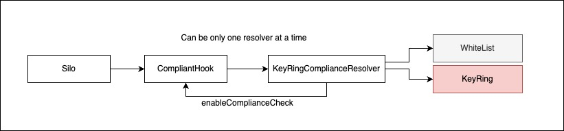

# Silo lending market compliance hook and its components

This document outlines the architecture and components of the compliance system integrated within the Silo Protocol. The compliance system enables regulatory checks for silo lending market actions through a flexible and composable architecture using KeyRing's zero-knowledge permissioning.

||
|:--:| 
| Silo Nova |

## Table of Contents

- [Component Overview](#component-overview)
- [Interfaces](#interfaces)
  - [ICompliantHook](#icompliant-hook)
  - [IComplianceResolver](#icompliance-resolver)
  - [IWhitelistComplianceResolver](#iwhitelist-compliance-resolver)
  - [IKeyRingComplianceResolver](#ikeyring-compliance-resolver)
  - [IKeyRing](#ikeyring)
- [System Architecture](#system-architecture)
- [Configuration Guide](#configuration-guide)
- [Integration Flow](#integration-flow)

## Component Overview

The compliance system consists of several interfaces that work together to provide a flexible permissioning framework:

1. **ICompliantHook** - Base interface for hook receivers to connect with compliance resolvers
2. **IComplianceResolver** - Core interface for compliance checking of protocol actions
3. **IWhitelistComplianceResolver** - Extension allowing whitelist-based exceptions to compliance checks
4. **IKeyRingComplianceResolver** - Implementation using KeyRing's policy-based compliance system
5. **IKeyRing** - External interface to KeyRing's credential verification service

## Interfaces

### ICompliant Hook

The `ICompliantHook` serves as the connection point between Silo Protocol operations and compliance checks.

```solidity
interface ICompliantHook {
    function setComplianceResolver(IComplianceResolver _resolver) external;
    function enableComplianceCheck(uint24[] memory _actions) external;
    function getComplianceResolver() external view returns (IComplianceResolver resolver);
}
```

This interface allows:
- Setting a specific compliance resolver implementation
- Enabling compliance checks for specific actions (this function is protected and allowed only for the resolver)
- Retrieving the currently configured compliance resolver

**Important:** If no compliance resolver is configured, all transactions will revert by default.

### IComplianceResolver

The `IComplianceResolver` defines the core interface for checking if an address is compliant for a specific protocol action.

```solidity
interface IComplianceResolver {
    function isCompliant(
        address _siloConfig,
        address _silo,
        uint256 _action,
        bytes calldata _actionData
    ) external view returns (bool);
}
```

Supported actions include:
- deposit
- borrow
- borrow same asset
- repay
- withdraw
- flash loan
- transition collateral
- switch collateral
- liquidation
- share collateral token transfer
- share protected collateral token transfer
- share debt token transfer

### IWhitelist Compliance Resolver

The `IWhitelistComplianceResolver` extends compliance checking with whitelist capabilities, allowing specific addresses to bypass compliance checks for selected actions.

```solidity
interface IWhitelistComplianceResolver {
    function addToWhitelist(uint256[] calldata _actions, address _address) external;
    function addToWhitelist(uint256 _action, address[] calldata _addresses) external;
    function removeFromWhitelist(uint256[] calldata _actions, address _address) external;
    function removeFromWhitelist(uint256 _action, address[] calldata _addresses) external;
    function isInWhitelist(uint256 _action, address _address) external view returns (bool status);
    function getWhitelist(uint256 _action) external view returns (address[] memory whitelist);
}
```

The whitelist functionality is particularly useful for:
- Exempting smart contracts that interact with the protocol (maybe a Silo Vault)
- Managing admin or partner addresses that have pre-verified compliance
- Creating exception lists for specific testing or emergency scenarios

### IKeyRing Compliance Resolver

The `IKeyRingComplianceResolver` implements compliance checking using KeyRing's policy-based system. It provides a flexible way to configure different policies for different actions based on pre-conditions.

```solidity
interface IKeyRingComplianceResolver is IComplianceResolver {
    function setPolicy(uint256 _action, ActionPolicyConfig[] memory _configs) external;
    function setPolicy(uint256[] calldata _actions, ActionPolicyConfig memory _config) external;
    function policiesConfigsForAction(uint256 _action) external view returns (ActionPolicyConfig[] memory configs);
    function KEYRING_CHECKER() external view returns (IKeyringChecker checker);
}
```

The resolver supports a sophisticated policy configuration system with several enums to define conditions:

```solidity
enum ComplianceCheck {
    // By design, if compliance check is not configured, we expect compliance hook to revert
    notConfigured,
    checkCompliance,
    skipCompliance
}

enum HasDebt {
    anyStateAcceptable,
    noDebt,
    hasDebtToken0,
    hasDebtToken1
}

enum DepositType {
    borrowableOrNonBorrowable,
    nonBorrowable,
    borrowable
}

enum AddressType {
    notConfigured, // AddressType is required for the policy config
    transactionSender,
    depositReceiver,
    borrowReceiver,
    borrowSameAssetReceiver,
    repayBorrower,
    withdrawReceiver,
    flashLoanReceiver,
    transitionCollateralOwner,
    liquidationBorrower,
    shareCollateralTokenTransferReceiver,
    shareProtectedCollateralTokenTransferReceiver,
    shareDebtTokenTransferReceiver
}

// Pre condition for the policy verification
struct ActionPolicyPreConditions {
    HasDebt hasDebt;
    DepositType depositType;
    AddressType addressType;
}

struct ActionPolicyConfig {
    ComplianceCheck complianceCheck; // shows if we want to check compliance
    ActionPolicyPreConditions preConditions;
    uint256 keyRingPolicyId;
}
```

Policies can be configured for combinations of:

1. Protocol actions (deposit, borrow, withdraw, etc.)
2. Debt status:
   - anyStateAcceptable
   - noDebt
   - hasDebtToken0
   - hasDebtToken1
3. Deposit type:
   - borrowableOrNonBorrowable
   - nonBorrowable
   - borrowable
4. Address role:
   - notConfigured
   - transactionSender
   - depositReceiver
   - borrowReceiver
   - borrowSameAssetReceiver
   - repayBorrower
   - withdrawReceiver
   - flashLoanReceiver
   - transitionCollateralOwner
   - liquidationBorrower
   - shareCollateralTokenTransferReceiver
   - shareProtectedCollateralTokenTransferReceiver
   - shareDebtTokenTransferReceiver

For example, you can configure policies like:
- Apply policy X when someone is withdrawing, has debt, from a borrowable deposit type, and is the withdraw receiver
- Apply policy Y when someone is depositing to a non-borrowable deposit, regardless of debt status

### IKeyRing

The `IKeyRing` interface provides the connection to KeyRing's credential verification service:

```solidity
interface IKeyring {
    function checkCredential(uint256 policyId, address entity) external view returns (bool);
}
```

This interface is used by the KeyRingComplianceResolver to check if an entity (address) has valid credentials for a specific policy.

## System Architecture

The compliance system follows this flow:

1. `Silo.sol` triggers a hook when an action (deposit, borrow, etc.) is performed
2. The hook, implementing `ICompliantHook`, receives the notification
3. The hook checks with its configured `IComplianceResolver` (typically a KeyRingComplianceResolver)
4. The resolver first checks if the address is whitelisted (using `IWhitelistComplianceResolver` functionality)
5. If not whitelisted, the resolver:
   - Determines which policy to apply based on action and pre-conditions
   - Calls KeyRing to check the address's credentials against the policy
6. The result is returned to the hook, which reverts the transaction if compliance fails

## Configuration Guide

### Configuring ICompliantHook

1. Deploy a silo with a hook that implements `ICompliantHook`
2. Set a compliance resolver for the hook:
   ```solidity
   hook.setComplianceResolver(resolver);
   ```

### Configuring IKeyRingComplianceResolver

1. Deploy a KeyRingComplianceResolver with the KeyRing address
2. Configure policies for specific actions with their pre-conditions:
   ```solidity
   // Set policy for a single action with multiple configurations
   resolver.setPolicy(
       WITHDRAW_ACTION, 
       [
           ActionPolicyConfig({
               complianceCheck: ComplianceCheck.checkCompliance,
               preConditions: ActionPolicyPreConditions({
                   hasDebt: HasDebt.hasDebtToken0,
                   depositType: DepositType.borrowable,
                   addressType: AddressType.withdrawReceiver
               }),
               keyRingPolicyId: policyId1
           }),
           ActionPolicyConfig({
               complianceCheck: ComplianceCheck.checkCompliance,
               preConditions: ActionPolicyPreConditions({
                   hasDebt: HasDebt.noDebt,
                   depositType: DepositType.nonBorrowable,
                   addressType: AddressType.transactionSender
               }),
               keyRingPolicyId: policyId2
           })
       ]
   );
   
   // Set the same policy config for multiple actions
   resolver.setPolicy(
       [DEPOSIT_ACTION, BORROW_ACTION], 
       ActionPolicyConfig({
           complianceCheck: ComplianceCheck.checkCompliance,
           preConditions: ActionPolicyPreConditions({
               hasDebt: HasDebt.anyStateAcceptable,
               depositType: DepositType.borrowable,
               addressType: AddressType.transactionSender
           }),
           keyRingPolicyId: commonPolicyId
       })
   );
   ```

### Managing Whitelists

Add addresses to the whitelist for specific actions:
```solidity
// Add a single address to multiple actions
resolver.addToWhitelist([DEPOSIT_ACTION, WITHDRAW_ACTION], contractAddress);

// Add multiple addresses to a single action
resolver.addToWhitelist(BORROW_ACTION, [address1, address2, address3]);
```

Remove addresses from the whitelist:
```solidity
// Remove a single address from multiple actions
resolver.removeFromWhitelist([BORROW_ACTION, WITHDRAW_ACTION], userAddress);

// Remove multiple addresses from a single action
resolver.removeFromWhitelist(DEPOSIT_ACTION, [address1, address2]);
```

## Integration Flow

The typical integration process involves:

1. **Create KeyRing Policies** - Use KeyRing's policy builder to create policies appropriate for your protocol's compliance requirements
2. **Deploy Resolver** - Deploy a KeyRingComplianceResolver configured with your KeyRing policies
3. **Configure Hook** - Set the resolver on your hook implementation
4. **Configure Whitelist** - Add any necessary exceptions to the whitelist (e.g., protocol contracts, admin addresses)
5. **Test Compliance Flow** - Verify that compliant users can interact with the protocol while non-compliant users are rejected

For more information on KeyRing integration, refer to the [KeyRing documentation](https://docs.keyring.network/docs) and specifically the [smart contract integration guide](https://docs.keyring.network/docs/integration-steps/3.-permission-smart-contracts).
